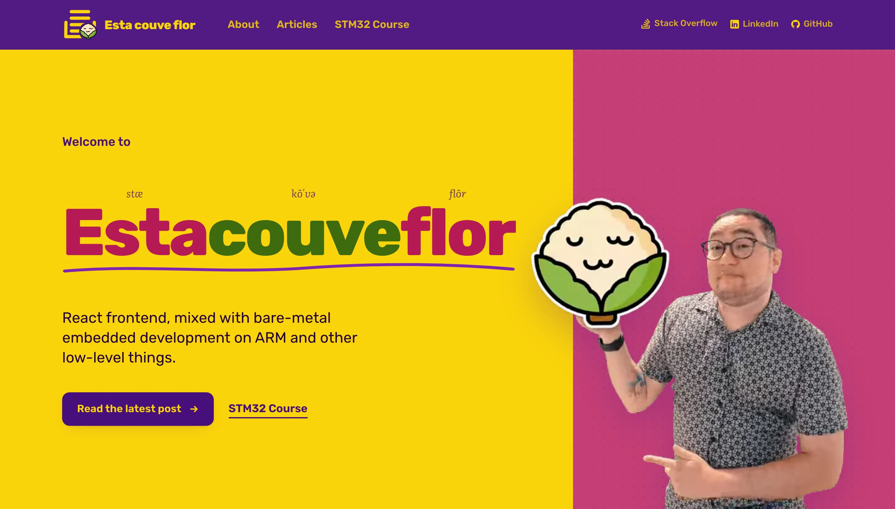
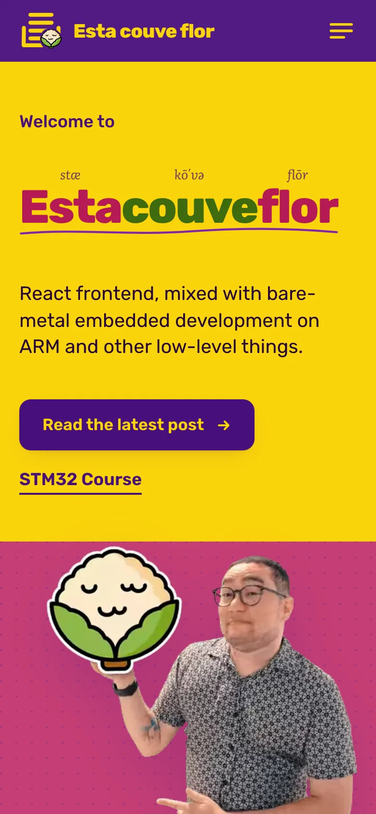
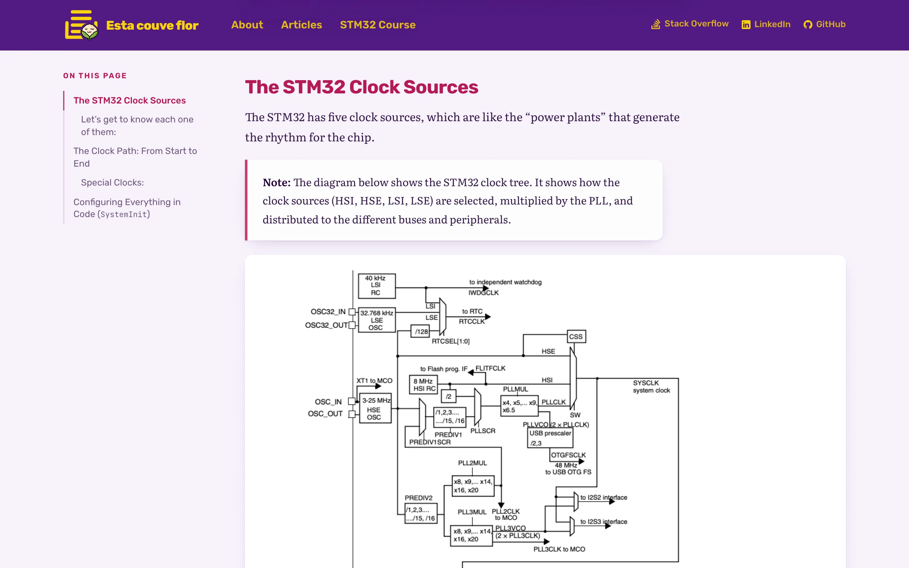

<div align="center">


# Esta couve flor

**Say it fast in Portuguese and you get "Stack Overflow".**<br>
A blog about the whole stack, from React on the screen down to the clock tree of an STM32.

[](https://github.com/klaygomes/klaygomes.github.io/actions/workflows/jekyll.yml) [](https://www.estacouveflor.com) [](LICENSE)

<a href="https://www.estacouveflor.com"></a>

</div>

## What you will find here

I have been shipping software since 2004, for banks, insurers, construction and tourism companies. Most of those years were spent on the frontend; lately, a good part of my spare time goes to ARM Cortex-M chips, the STM32F1 series in particular. This blog is where both sides meet.

A few posts worth starting with:

- [Understanding the heart of the STM32: the clock system](https://www.estacouveflor.com/entendendo-coracao-stm32/): HSI, HSE, the PLL and how the 72 MHz actually reaches your peripherals.
- [Free tools for embedded development](https://www.estacouveflor.com/stm32-sem-usar-ide/): a Cortex-M toolchain with GCC, Make and OpenOCD, no vendor IDE needed.
- [Using GNU Make as your dotfiles manager](https://www.estacouveflor.com/dotfiles-configuration/): one command to set up a fresh Mac.
- [The STM32 course](https://www.estacouveflor.com/curso-stm32/): free video lessons on VSCode, GDB, CMSIS and the Arm toolchain.

<div align="center">
&nbsp;&nbsp;

</div>

## Running it locally

You need Ruby 3.1 with Bundler and Node 24.

```bash
bundle install
yarn install
yarn start        # serves on http://localhost:4000 with live reload
```

After changing templates or CSS classes, run `yarn build` and commit `assets/css/main.build.css` with your change.

```text
_posts/            the articles
_layouts/          page, post and home templates
_includes/         nav, footer, table of contents, article list
assets/css/        stylesheets
assets/video/      videos
docs/              README images
```

## Say hi

If a post here saved you an afternoon, or you are stuck on something where the browser and the bare metal meet, I am happy to hear about it: [email@cleiton.dev](mailto:email@cleiton.dev) or [LinkedIn](https://www.linkedin.com/in/klaygomes/).

<sub>[MIT License](LICENSE)</sub>
